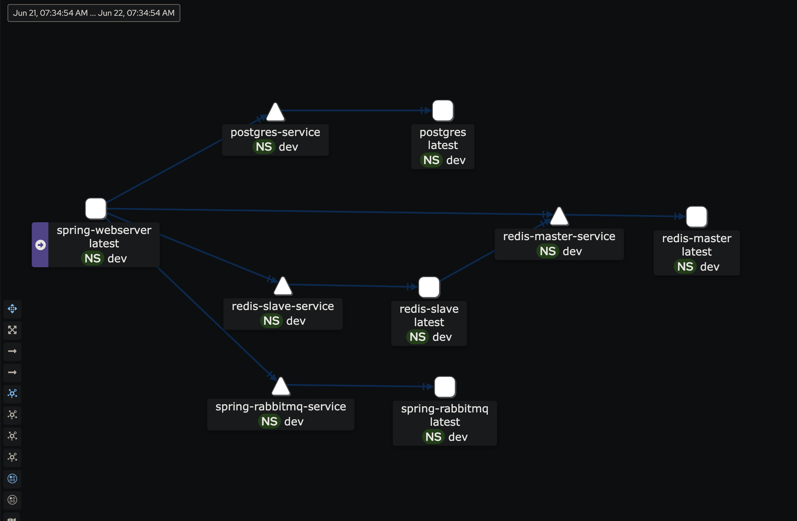

## 🦊 **Purpose**
This demo is for testing some tools.

## 💻 **Prerequisites**
1. install java17
```install java17
brew install openjdk@17
```
2. Install docker
``` install docker
brew install docker 
```

3. Install tmux *(Optional)*
``` install tmux
brew install tmux
```

4. Install k3d *(Optional)*
``` install k3d
brew install k3d
```

5. Install terraform *(Optional)*
``` install terraform
brew install terraform
```

6. Install istioctl *(Optional)*
``` install istioctl
brew install istioctl
```

## ⚾️ **Play on local**
1. Start all service(database, message queue...) <br />
```bash
./docker-starter.sh
```

2. Start webserver application by your IDE

## 🐳 **Scripts**
1. `terrafrom-starter.sh` uses yaml file to launch the services.
2. `docker-starter.sh` uses docker image to launch the services.
3. `k3d-starter.sh` uses k3d to launch the services including ***webserver***, and it can use istio as well.
4. `docker-ci-tester.sh` is for test on CI instead of local.
5. `local-starter.sh` is for local development.
6. `.env` is to connect Saas. Create your own env file after you have supabase and rabbitmsq service to use.

## 📦 **Architecture**
